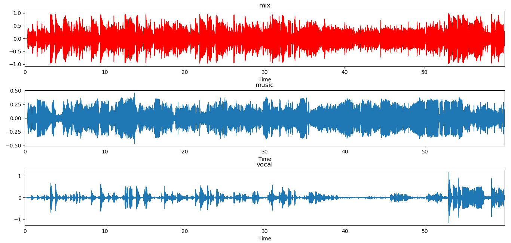
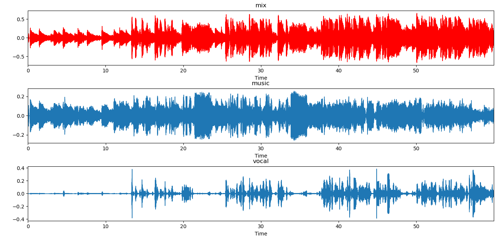

# Introduction
I used **librosa** for vocal-music separation by applying two soft masks on the audio file,
 one for extracting the music and the other for the vocals.
 
 # Steps
 - After running the python file you will be asked to browse for an audio file.
 
 -  The spectrogram magnitude and phase will be computed.
 
 - We'll compare frames using cosine similarity, and aggregate similar frames 
 by taking their (per-frequency) median value.
 
 - We'll take the output filter and use it as a mask. we will generate two soft masks with two different margins 
 to be able to extract music and vocals.
 
 - Once we have the masks, simply multiply them with the input spectrum to separate the components.
 
 - multiply the magnitude component with phase to restore the wav files of the vocals and music.
 
 - Export both the music audio file and the vocals audio file.
 
 - Finally, three plots will appear as waveform graphs. one for the original audio and the other two 
 for the generated music and vocals.
 
 # Output Samples
 I tested my program using three different songs:
 
|        Song       |    Artist   |
|:-----------------:|:-----------:|
| Million Years Ago |    Adele    |
|   Strange Birds   |    Birdy    |
|      All Of Me    | John Legend |

And the folder for each song contains the original song with its generated music and vocals files 
and the plot of their waveforms.

## Output samples plots

### 1. Million Years Ago

### 2. Strange Birds

### 3. All Of Me

